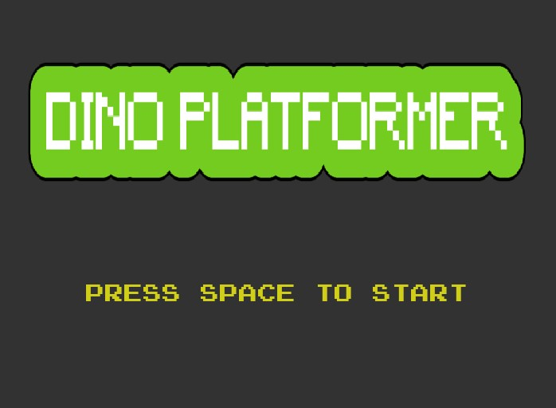
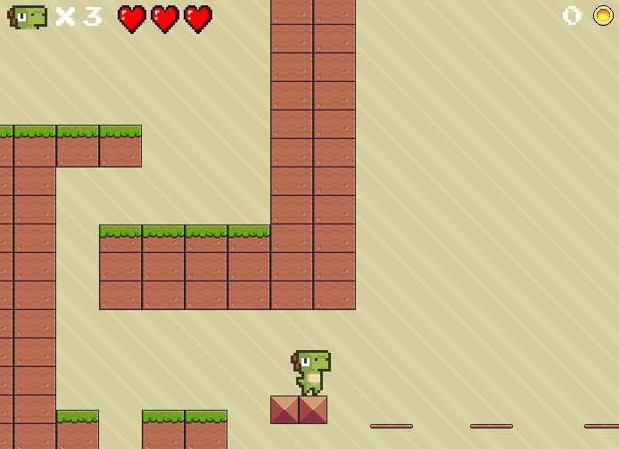
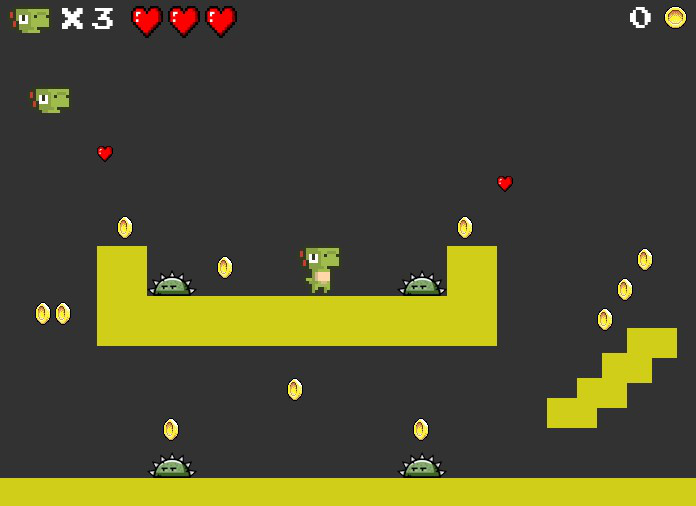

# Dino Platformer Game (Python)

🇺🇸 A platformer game built with Python and Pygame. It features one TMX level and one debug level.

🇫🇷 Dino Platformer : un jeu de plateformes construit en Python avec Pygame. Il se compose d’un niveau TMX et d’un niveau de débogage.

## 📸 Game Preview

### 1️⃣ TMX Level

### 0️⃣ Debug Level

